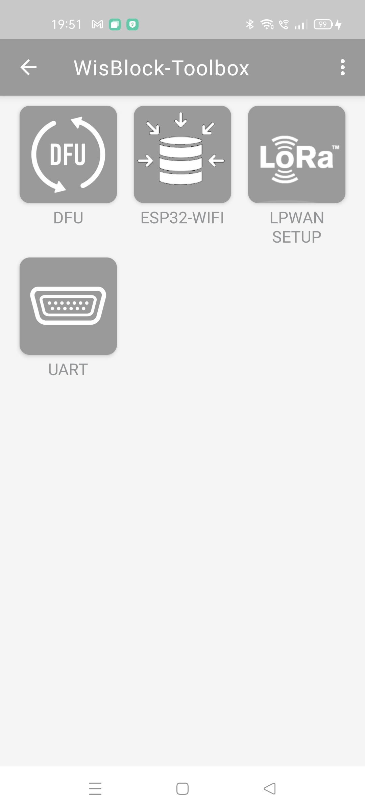
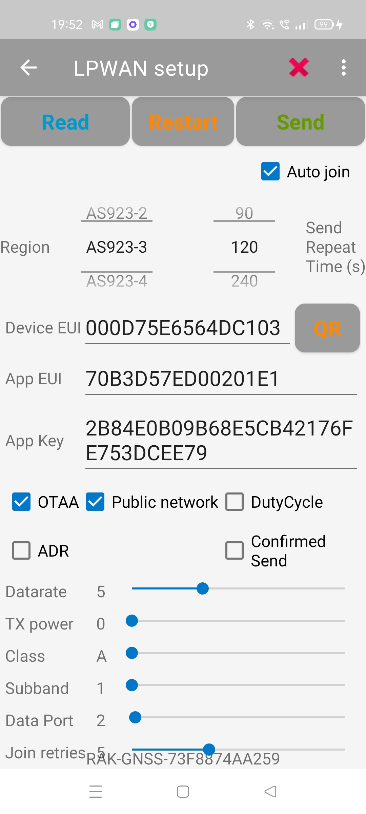

|   |   |   |
| :-: | :-: | :-: |
|  |  |  |

# WisBlock Toolbox
Simplified toolbox created from [Nordic's nRF52 Toolbox](https://github.com/NordicSemiconductor/Android-nRF-Toolbox)

This application supports right now 4 functions
- Firmware update over BLE with OTA DFU for [WisBlock Core RAK4631](https://docs.rakwireless.com/Product-Categories/WisBlock/RAK4631/Overview)
- BLE UART application
- Setup LoRa® and LoRaWAN® parameters of RAK4631 devices over BLE
- Setup [WisBlock Core RAK11200](https://docs.rakwireless.com/Product-Categories/WisBlock/RAK11200/Overview) WiFi credentials over BLE     

It is a compagnion to the [WisBlock API](https://github.com/beegee-tokyo/WisBlock-API) which supports the OTA DFU firmware update and the LoRa® / LoRaWAN® configuration over BLE.

BLE UART, BLE DFU OTA and LoRa® / LoRaWAN® configuration works with 
- [RAK4631-LoRa-BLE-Config](https://github.com/beegee-tokyo/RAK4631-LoRa-BLE-Config) example
- [RAK4631-Kit-4-RAK1906](https://github.com/beegee-tokyo/RAK4631-Kit-4-RAK1906)
- [RAK4631-Kit-1-RAK1901-RAK1903-RAK1903](https://github.com/beegee-tokyo/RAK4631-Kit-1-RAK1901-RAK1902-RAK1903)
- [RAK4631-Kit-2-RAK1910-RAK1904-RAK1906](https://github.com/beegee-tokyo/RAK4631-Kit-2-RAK1910-RAK1904-RAK1906)
- [RAK4631-Kit-2-RAK12500-RAK1906](https://github.com/beegee-tokyo/RAK4631-Kit-2-RAK12500-RAK1906)
- Any application that is based on the [WisBlock API](https://github.com/beegee-tokyo/WisBlock-API)

WiFi setup over BLE works with
- [RAK11200-WiFi-setup-over-BLE](https://github.com/beegee-tokyo/RAK11200-WiFi-setup-over-BLE)

# License
Parts of this code are under Nordic Semiconductor license => [LICENSE-NORDIC](./LICENSE-NORDIC).    
Functions that I have added are licensed under [The Unlicense](./LICENSE)     

# WORK IN PROGRESS => NO GUARANTEE THAT IT WORKS ON YOUR PHONE

## OTA DFU
The OTA DFU is used to update the firmware or bootloader of the RAK4631 module using BLE. The new firmware must be copied to the phone as .ZIP file.     
More details in the [NordicSemiconductor/Android-DFU-Libray](https://github.com/NordicSemiconductor/Android-DFU-Library)    
OTA DFU requires to enable the Nordic DFU service in the RAK4631.    
If the WisBlock API is used, OTA DFU is supported if BLE is enabled.

## BLE UART
This is simple BLE UART terminal that can connect to Nordic UART characteristic. It can send and receive text only.     
If the WisBlock API is used, BLE UART is supported if BLE is enabled.

## RAK11200 WiFi configuration
Setup the WiFi configuration of the RAK11200 without hard-coding the WiFi AP name and password in your source codes.    
Works with [RAK11200-WiFi-setup-over-BLE](https://github.com/beegee-tokyo/RAK11200-WiFi-setup-over-BLE) example code running on the RAK11200

### Screenshots

## LoRa® / LoRaWAN® configuration
- Setup nodes that support LoRa® P2P
- Setup nodes that support LoRaWAN®
- Setup nodes that support both LoRa® P2P and LoRaWAN®
- Build in QR scanner to read DeviceEUI / JoinEUI from a label on the device

### Screenshots

Start screen

LPWAN OTAA setup    

----
LPWAN ABP setup    

----
P2P setup    

----

Scan QR code    
